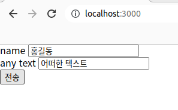
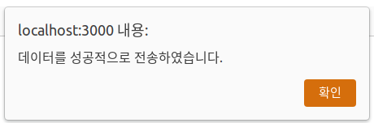
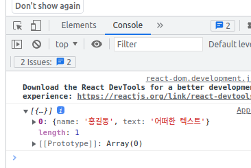

# docker-practice

## Mission
### Frontend
- Container 이름: `frontend`
- 사용 이미지: `node:18`
- 컨테이너 특징
  - port: 3000
- 빌드 순서
  1. package.json을 가장 우선적으로 설치
     - 명령어: `$ npm install`
  2. 환경변수 설정
     - NODE_PATH = \[작업경로 + node_modules\]
       - ex. NODE_PATH = /root/node_modules
  3. 서버 실행 명령어: `$ npm start`

### Backend
- Container 이름: `backend`
- 사용 이미지: `python:3`
- 컨테이너 특징
  - port: 5000
- 빌드 순서
  1. Package 설치
     - `$ pip install fastapi uvicorn pymongo`
  2. 서버 실행 명령어: `$ python app.py`

### Database
- Container 이름: `database`
- 컨테이너 특징
  - port: 27017

## 결과
1. 데이터 입력
   - 
2. 전송 버튼 클릭
   - alert 식별
   - 
3. 데이터 불러오기 버튼 클릭
4. 개발자 모드(F12) -> Console을 통해 데이터 호출 식별
   - 
